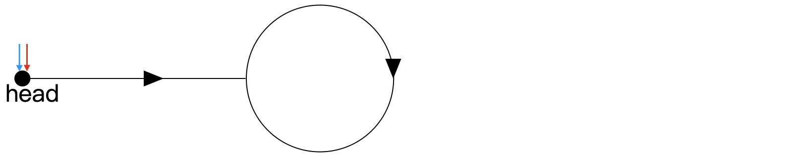
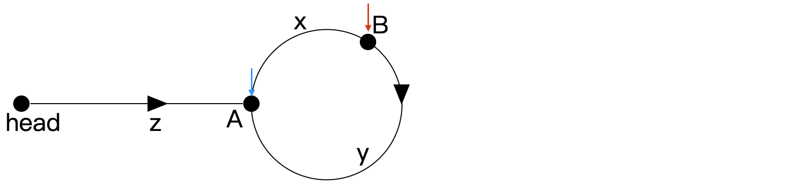
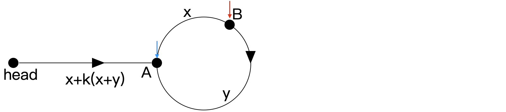
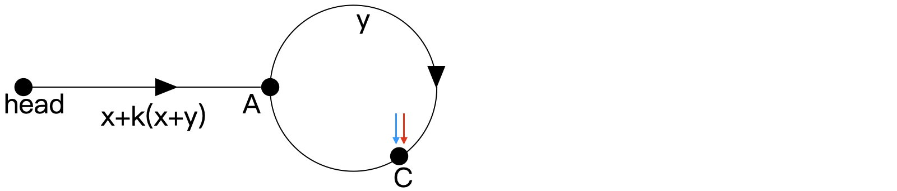
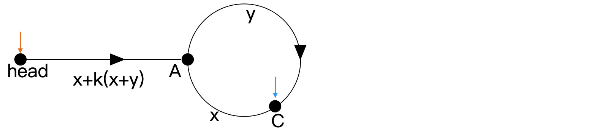
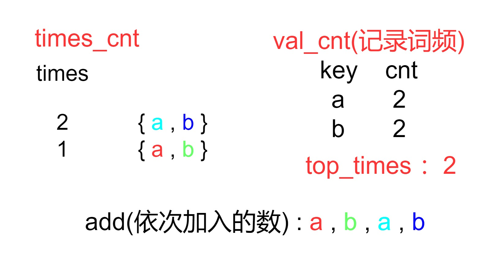
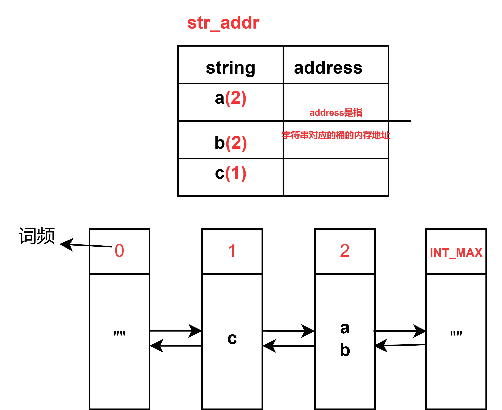

### 插入排序

第一次写成了：

```cpp
template <typename T>
        std::vector<T> insert_sort(const std::vector<T>& arr){
            int len = arr.size();
            if(len < 2) return arr;

            std::vector<T> _arr(arr);

            for(int i = 1 ; i < len ; i++){
                for(int j = i-1 ; j >= 0; j--){
                    if(_arr[j] > _arr[j+1])
                    	swap(_arr[j] , _arr[j+1]);
                }
            }

            return _arr;
        }
```

* 这样写当然也行，但写成这样可以省去一些计算

```cpp
template <typename T>
        std::vector<T> insert_sort(const std::vector<T>& arr){
            int len = arr.size();
            if(len < 2) return arr;

            std::vector<T> _arr(arr);

            for(int i = 1 ; i < len ; i++){
                for(int j = i-1 ; j >= 0 && _arr[j] > _arr[j+1]; j--){
                    swap(_arr[j] , _arr[j+1]);
                }
            }

            return _arr;
        }
```

* 将判断条件`_arr[j] > _arr[j+1]`放在`for`循环中，若`_arr[j] < _arr[j+1]`，那`_arr[j+1]`左边的数一定都比它小了，不需要向右插入了。


### 循环队列

* 队列长度要多开辟一段空间(`len = k + 1`)
* 队列满时判断条件`(rear+1)%len == front`
* 队列取队尾的数时`return q[(rear-1+len)%len]`

```cpp
// https://leetcode.cn/problems/design-circular-queue/

class MyCircularQueue {
private:
    int* q;
    int len;
    int front = 0 , rear = 0;

public:
    MyCircularQueue(int k): len(k+1) {
        q = new int[k+1];
    }
    
    bool enQueue(int value) {
        if((rear+1)%len == front){
            return false;
        }
        else{
            q[rear] = value;
            rear = (rear + 1) % len;
            return true;
        }
    }
    
    bool deQueue() {
        if(front == rear)   return false;
        else{
            front = (front + 1) % len;
            return true;
        }
    }
    
    int Front() {
        if(front == rear)   return -1;
        else    return q[front];
    }
    
    int Rear() {
        if(front == rear)   return -1;
        else return q[(rear-1+len) % len];
    }
    
    bool isEmpty() {
        if(front == rear)   return true;
        else return false;
    }
    
    bool isFull() {
        if((rear+1)%len == front)   return true;
        else return false;
    }
};
```


### 用栈模拟队列

这道题的`in2out`方法的设计简直太绝了！！！

时间复杂度是O(1)：对于每一个数，`push`和`pop`最多经历4次出入栈，复杂度为O(1)

[232. 用栈实现队列 - 力扣（LeetCode）](https://leetcode.cn/problems/implement-queue-using-stacks/)

[225. 用队列实现栈 - 力扣（LeetCode）](https://leetcode.cn/problems/implement-stack-using-queues/submissions/536758851/)

```cpp
class MyQueue {

private:
    std::stack<int> in;//in用来入队列，out用来出队列
    std::stack<int> out;
    void in2out(){
        // 倒数据
		// 从in栈，把数据倒入out栈
		// 1) out空了，才能倒数据
		// 2) 如果倒数据，in必须倒完

        if(out.empty()){
            while(!in.empty()){
                int x = in.top();
                in.pop();
                out.push(x);
            }
        }
    }
public:
    MyQueue() {

    }
    
    void push(int x) {
        in2out();
        in.push(x);
    }
    
    int pop() {
        in2out();
        int x = out.top();
        out.pop();
        return x;
    }
    
    int peek() {
        in2out();
        return out.top();
    }
    
    bool empty() {
        return in.empty() && out.empty();
    }
};
```


### class019 输入输出

* 填函数风格

例如`leecode`

* acm风格（笔试、比赛最常见）

  * 规定数据量(BufferedReader、StreamTokenizer、PrintWriter)，其他语言有对等的写法

  * 按行读(BufferedReader、PrintWriter)，其他语言有对等的写法(cpp中用printf、scanf比cin、cout更快)

  * 不要用Scanner、System.out，IO效率慢(输出答案要一次输出，不要边运行程序边输出，一旦后台检测到输出，就会开始对比，频繁启动对比耗时比最后一次性进行对比多)。

* 不推荐：临时动态空间(①申请、释放空间耗时；②释放的空间后台仍会记录到内存消耗中：例如，在程序中，先开辟1MB的空间，使用完后释放，再开辟2MB空间，再释放，其实我们使用的空间最大是2MB，但后台不会检测是否释放，会认定使用的空间是3MB)

* 推荐：全局静态空间


### class022 归并分治

* 思考一个问题在大范围上的答案，是否等于，左部分的答案 + 右部分的答案 + 跨越左右产生的答案
* 计算“跨越左右产生的答案”时，如果加上左、右各自有序这个设定，会不会获得计算的便利性
* 如果以上两点都成立，那么该问题很可能被归并分治解决（话不说满，因为总有很毒的出题人）


### class025

堆排序的时间复杂度 ==待整理==


###　class026 比较器

参考链接：

* [Comparator in C++ - GeeksforGeeks](https://www.geeksforgeeks.org/comparator-in-cpp/#)

* [Custom Comparator in Priority_queue in C++ STL - GeeksforGeeks](https://www.geeksforgeeks.org/custom-comparator-in-priority_queue-in-cpp-stl/)

> In C++, a ***\*comparator\**** is a function or a function (an object that acts like a function) that is used to compare elements. It is widely used in **sorting** algorithms or in data structures like **std::sort** or **std::priority_queue** to define custom sorting orders. It can be used to **define specific rules** for comparing elements, influencing the order in which they appear.
>
> The comparator function generally takes **two parameters** (values to compare) and returns a **boolean value** based on their comparison. Such functions are also called binary predicate.  Although, there is no limitation on the number or parameters the comparator function can take.

比较器有三种实现方式：

* 函数指针
* lambda表达式
* 仿函数(Functor)

#### 函数指针

* 函数指针是一种特殊类型的指针，用于指向函数的地址，从而实现对该函数的调用。
* 函数指针的定义：

定义一个函数指针需要同时声明函数的**返回类型**和**参数类型**，例如：

```cpp
int add(int a , int b){
    return a + b;
}

int (*func_ptr) (int , int);
func_ptr = add;//也可以写成func_ptr = &add;实际上函数名就是对应的函数指针

int result = func_ptr(3, 4); // 调用 add(3, 4)
std::cout << "Result: " << result << std::endl; // 输出：Result: 7
```

* 函数指针可以作为其他函数的参数，从而实现**策略模式**：

```cpp
#include<iostream>

int add(int a , int b){
    return a + b;
}

int sub(int a , int b){
    return a - b;
}

void compute_and_print(int (*funct_ptr)(int , int) , int a , int b){
    std::cout << "Result: " << funct_ptr(a , b) << std::endl;
}
int main()
{
    compute_and_print(add , 3 , 4);
    compute_and_print(sub , 3 , 4);

}
```

还有一种用法：

例如我要实现以下逻辑：

```cpp
if(condition){
	func1();
}
else{
    func2();
}

.....some other codes
    
if(condition){
	func1();
}
else{
    func2();
}
......
```

如果不使用函数指针，每一次都需要对`condition`进行一次判断来确定调用的函数，尽管我们可以通过第一次`condition`的判断确定之后所有需要调用的函数。

可以用函数指针如下简洁地实现、同时减少了无效的判断：

```cpp
if(condition){
	func_ptr = func1;
}
else{
    func_ptr = func2;
}

.....some other codes
    
func_ptr();
......
func_ptr();   
```

* 用函数指针实现`std::sort`的定制：

```cpp
//递减排序
bool comparator(int a , int b){
    return a > b;
}//a > b时函数返回true , 表明越大的数优先级越高，排在越靠前

std::sort(arr.begin() , arr.end() , comparator);
//或 std::sort(arr.begin() , arr.end() , std::greater<int>())
```

* 用函数指针实现`std::priority_queue`小根堆

```cpp
bool (*func_ptr) (int , int) = comparator;
std::priority_queue<int , std::vector<int> , decltype(func_ptr) > min_heap(func_ptr);
```

`decltype`将`func_ptr`自动推导为`priority_queue`的类型。

稀奇古怪的写法，还是用仿函数吧

#### lambda表达式

语法：

> [捕获列表] (参数列表) -> 返回类型{函数主体}
>
> [capture list] (parameter list) -> return type {function body}

* 捕获列表可以捕获`lambda`表达式外的变量，分为`值捕获`和`引用捕获`

```cpp
	int x = 10;
    auto f = [x] (int y) -> int { return x + y; }; // 值捕获 x，相当于执行这一行时复制了一份x的值进入了lambda表达式
    x = 20; // 修改外部的 x
    std::cout << f(5) << std::endl; // 输出 15，不受外部 x 的影响

    auto f2 = [&x](int y) {return x + y;} ;  // return type可以省略，由表达式自动推导
    x = 30;
    std::cout << f2(5) << std::endl; // 输出35 ， 受外部x的影响

    auto f3 = [&x]() {x++; return 0;};// 引用捕获可以在lamda表达式内修改参数值
    f3();
    std::cout << "x = " << x << std::endl;//31

    auto f4 = [&](int y) {return x + y;};//对所有外部变量采用引用捕获
    auto f5 = [=](int y) {return x + y;};//对所有外部变量采用值捕获

    x = 100;

    std::cout << "f4 : " << f4(5) << std::endl;// 105
    std::cout << "f5 : " << f5(5) << std::endl;// 36

    int a = 10;
    auto f6 = [& , a](int y){return x + a + y;};//引用捕获所有除了a的变量，值捕获a
    auto f7 = [= , &a](int y) {return x + a + y;};//值捕获所有除了a的变量
```

* `lambda`表达式实现`Sort characters in increasing frequency and same frequency in decreasing alphabetical order.`

```cpp
#include<iostream>
#include<string>
#include<unordered_map>
#include<algorithm>
int main()
{
    std::string s = "hellloooo geek";
    std::unordered_map<char , int> cnt;
    int n = s.size();
    for(int i = 0 ; i < n ; i++){
        cnt[s[i]]++;
    }

    auto comparator = [&](char a , char b){
        if(cnt[a] == cnt[b]){
            return a > b;
        }
        else{
            return cnt[a] > cnt[b];
        }
    };

    std::sort(s.begin() , s.end() , comparator);
    std::cout << s << std::endl;//oooollleeekhg
	return 0;
}
```


#### 仿函数

参考链接：[Functors in C++ - GeeksforGeeks](https://www.geeksforgeeks.org/functors-in-cpp/)

* 仿函数实现小根堆

```cpp
#include <iostream>
#include <queue>
#include <vector>

// 仿函数用于比较两个元素，以实现小根堆
class MinHeapComparator {
    bool operator()(int a, int b) {
        return a > b;
    }
};

int main() {
    // 使用std::priority_queue和MinHeapComparator仿函数创建小根堆
    std::priority_queue<int, std::vector<int>, MinHeapComparator> minHeap;
    //std::priority_queue<int, std::vector<int>, greater<int> > minHeap;

    // 向小根堆添加元素
    minHeap.push(5);
    minHeap.push(2);
    minHeap.push(8);
    minHeap.push(1);
    minHeap.push(6);

    // 打印小根堆
    while (!minHeap.empty()) {
        std::cout << minHeap.top() << " ";
        minHeap.pop();
    }
    std::cout << std::endl;

    return 0;
}

```


### class027

* 所有结点进一个容器，排序，再连接：$O(n) + O(nlogn) + O(n) = O(nlogn)$ , 空间复杂度$$O(n)$$


* 用堆进行维护，时间复杂度$O(n*logk)$, $k$是链的条数,遍历每个结点需要$$O(n)$$,每个结点进堆调整堆$$O(logk)$$ , 因此时间复杂度$O(n * logk)$


### class034

**`linked list cycleii`证明**

* [142. 环形链表 II - 力扣（LeetCode）](https://leetcode.cn/problems/linked-list-cycle-ii/description/)

* 参考 [题解](https://leetcode.cn/problems/linked-list-cycle-ii/solutions/2832831/jian-ji-qing-xi-yan-jin-de-tu-shi-tui-da-nak2/)

1. 重画链表如下所示，线上有若干个节点。记蓝色慢指针为 `slow`，红色快指针为 `fast`。初始时` slow` 和 `fast` 均在头节点处。



2. `slow` 和 `fast` 同时前进，`fast` 的速度是 `slow` 的两倍(`fast`一次跨过两个结点)。当 `slow` 抵达环的入口处(图中`A`) 时，`fast` 一定在环上(图中`B`)，如下所示。



图中：

- `head` 和 `A` 的距离为 `z`
- 弧 `AB` (沿箭头方向) 的长度为 `x`
- 同理，弧 `BA` 的长度为 `y`

可得：

- `slow` 走过的距离为 `z`
- 设 `fast` 已经走过了 `k`个环，$k≥0$，对应的距离为 $z+k(x+y)+x$

由`fast`的速度是`slow`的两倍，得：$z + k(x+y)+x = 2z$ , 化简得$z = k(x+y)+x$



此时`fast`在`B`点，`slow`在`A`点，`fast`与`slow`的相对速度为1 ，` fast`只需`y`个单位时间后即可**追上**`slow` ， 即`slow`走`y`个单位长度，`fast`走`2y`个单位长度。设相遇在 `C` 点，位置如下所示，可得弧 `AC `长度为` y`。



因为此前`x+y` 为环长，所以弧 `CA` 的长度为 `x`。
此时我们另用一橙色指针 `ptr` (pointer) 指向 `head`，如下所示。并使 `ptr` 和 `slow` 保持 1 个单位的速度前进，在经过 $z=x+k(x+y)$ 步后，可在 `A` 处相遇(`slow`从C出发，走$x + k(x+y)$的距离，相当于绕环`k`圈回到C ， 再走`x`到A)。证毕。



```cpp
#include<iostream>
struct ListNode {
    int val;
    ListNode *next;
    ListNode(int x) : val(x), next(nullptr) {}
};
class Solution {
public:
    ListNode *detectCycle(ListNode *head) {
        if(head == nullptr || head->next == nullptr)    return nullptr;

        ListNode* fast = head , *slow = head;
        do
        {
            slow = slow->next;
            fast = fast->next->next;
            if(fast == nullptr || fast->next == nullptr)    return nullptr;
        } while (slow != fast);

        //以上的循环不要写成：(好傻逼，这个循环一次都运行不了，因为赋值后，fast = slow = head)
        // while(fast != slow){
        //     if(fast->next == nullptr || fast->next->next == nullptr)    return nullptr;

        //     fast = fast->next->next;
        //     slow = slow->next;
        // }
        

        ListNode* ptr = head;
        while(ptr != slow){
            ptr = ptr->next;
            slow = slow->next;
        }

        return ptr;
    }
};
```


### class035

[895. 最大频率栈 - 力扣（LeetCode）](https://leetcode.cn/problems/maximum-frequency-stack/description/)



如上图，依次向`最大频率栈`中加入`a , b , c , d` , 同时更新`val_cnt` , `times_cnt` , `top_times` : 

* `val_cnt` : `std::unordered_map<int,int>`  ,  `times_cnt` : `std::unordered_map<int , std::vector<int>>`
* 加入第一个`a`时，`val_cnt`中记录`a`的词频为1 ， `top_times`为1(表示此时最大的词频是1) ， 同时`times_cnt`中`times = 1`对应的那一层`vector`中加入`a` 。 
* `times_cnt`中每一层的`vector`存储着入栈时词频为`times`的所有元素，例如，`times_cnt[1] = {a , b}` , 表示`a , b`这两个元素在入栈时的词频均为1；`times_cnt[2] = {a , b}` , 表示`a,b`这两个元素(与之前的`a,b`不同)在入栈时，词频均为2。
* `pop`操作：要让词频最高、若词频相同则后入栈优先的元素出栈，只需返回`times_cnt[top_times].back()`，即词频最大值对应的`vector`的最后一个元素。同时注意：①将`val_cnt`中对应词频减1；②更新`top_times`：若`times_cnt[top_times]`在弹出元素后为空，应删除此键值对，并将`top_times`减1。


[432. 全 O(1) 的数据结构 - 力扣（LeetCode）](https://leetcode.cn/problems/all-oone-data-structure/description/)

* 这个题是[146. LRU 缓存](https://leetcode.cn/problems/lru-cache/description/) 的进阶，思路相似。

  

​    

* 定义一个桶`bucket`，其中成员变量有**词频**(`int`)、以及**对应词频的字符串**(使用`std::unordered_set<std::string>`存储)。例如上图中双向链表第二个结点表示：字符串`c`的词频为`1`；第三个结点表示：字符串`a`和`b`的词频均为2。`bucket`构成双向链表的结点，双向链表的头结点、尾结点(`head,tail`)分别是词频为`0`和`INT_MAX`的`bucket`，其中字符串均为空。给双向链表添加`head` `tail`一方面是可以满足题目要求返回`""` , 另一方面可以方便`insert`、`remove`函数的书写(不用去考虑结点在头、尾的边界条件)

* 使用`std::unordered_map<std::string , bucket*> str_addr`构建字符串与对应桶地址的键值对。例如`str_addr[a]`指向双向链表中**第三个结点**。

* 那么，向该数据结构中加入、删除字符串的过程，就是维护`str_addr`和双向链表的过程。

* 加入字符串分为以下情况：①该字符串是新的(即当前数据结构中不存在该字符串)。②该字符串是老的(即当前数据结构中存在该字符串)。

  * 新字符串

  新字符串词频为1，将字符串加入词频为1的桶中。若无词频为1的桶，则新建桶后再加入。

  ```cpp
  if(str_addr.find(key) == str_addr.end()){//没找到该字符串,新字符串
              if(head->next->cnt != 1){//没有词频为1的桶
                  bucket* tmp = new bucket(key , 1);//新建词频为1的桶
                  insert(head , tmp);//insert自定义函数，将词频为1的桶插入head结点后
                  str_addr[key] = tmp;//记录新字符串存储位置(桶的地址)
              }
              else{//有词频为1的桶，直接加入即可
                  head->next->set.insert(key);
                  str_addr[key] = head->next;
              }
               
          }
  ```

  * 旧字符串

  若加入的字符串已存在，则使用`str_addr`查出字符串在桶的地址，将该字符串从该桶中移除，加入`词频+1`的桶中(若无该桶，则新建桶再加入)。例如加入字符串`a`，则将`a`从**词频为2**的桶中移除，新建**词频为3**的桶，将`a`加入该桶中。

  ```cpp
  else{//有这个字符串，旧字符串
              bucket* key_addr = str_addr[key];//找出该字符串存在哪个桶里
              if(key_addr->cnt + 1 != key_addr->next->cnt){//没有cnt + 1的桶，就新建一个
                  bucket* tmp = new bucket(key , key_addr->cnt + 1);
                  insert(key_addr , tmp);
              }
              
              key_addr->set.erase(key);
              key_addr->next->set.insert(key);
              str_addr[key] = key_addr->next;
              if(key_addr->set.empty()){//如果桶已经空了，则删除桶
                  remove(key_addr);
              }
          }
  ```


* 从数据结构中删除字符串：①若该字符串词频为1，则直接将其从词频为1的桶中移除即可；②该字符串词频大于1，则将该字符串移到`词频-1`的桶中(若无桶，则建桶).

  ```cpp
  void dec(string key) {
          bucket* key_addr = str_addr[key];
          if(key_addr->cnt == 1){//若该字符串词频为1，则直接将其从词频为1的桶中移除即可
              str_addr.erase(key);
          }
          else{// 该字符串词频大于1，则将该字符串移到`词频-1`的桶中
              if(key_addr->cnt - 1 == key_addr->last->cnt){
                  key_addr->last->set.insert(key);
                  str_addr[key] = key_addr->last;
              }
              else{
                  bucket* tmp = new bucket(key , key_addr->cnt - 1);//新建词频为cnt-1的桶
                  insert(key_addr->last , tmp);
                  str_addr[key] = tmp;
              }
          }
  
  
          key_addr->set.erase(key);//从原桶中移除该字符串
          if(key_addr->set.empty()){//若移除后，桶空了，则删除桶
              remove(key_addr);
          }
      }
  ```


* `getMaxKey、getMinKey`

```cpp
string getMaxKey() {
        return *(tail->last->set.begin());
    }
    
    string getMinKey() {
        return *(head->next->set.begin());
    }
```

**总结**

* 我们对这道题做**退一步的简化** ：如果**不用设计**该数据结构的`dec`方法，那么这道题如何解？

该数据结构要满足：`inc`方法添加字符串，`getMaxKey` `getMinKey`分别返回词频最大、最小的字符串

那么，只需要一个哈希表记录词频，`string`变量`MaxKey`、`MinKey`记录词频最大、最小的字符串即可(代码如下，未验证正确性)：

```cpp
#include<string>
#include<unordered_map>
using namespace std;
class AllOne {
private:
    unordered_map<string , int> key_cnt;
    string max_key;
    string min_key;
    int max_cnt = 0 , min_cnt = INT_MAX;
public:
    AllOne():max_key("") , min_key("") {

    }
    
    void inc(string key) {
        key_cnt[key]++;
        if(key_cnt[key] > max_cnt){
            max_key = key;
            max_cnt = key_cnt[key];
        }

        if(key_cnt[key] < min_cnt){
            min_cnt = key_cnt[key];
            min_key = key;
        }

    }
    
    // void dec(string key) {

    // }
    
    string getMaxKey() {
        return max_key;
    }
    
    string getMinKey() {
        return min_key;
    }
};
```

因为不涉及到删除该数据结构中字符串的操作`dec`，因此只需要对新加入的字符串进行判断即可。但如果该数据结构存在字符串的删除这一操作，则需要去解决一个问题：如果当前最大词频的字符串被删除了，如果找到新的最大词频的字符串？这一问题往往用**双向链表**解决。

* ①要得到最大、最小值(不一定是值的最大最小，还可能是词频的大小)、②要求复杂度$O(1)$ 、③数据流期间有元素的删除。有以上三个要求的数据结构，似乎都要借助双向链表来解决。比如之前的`lru`那道题，还有我自己想了一道题：一个数据结构可以用`add`方法进数，同时也可以随时用`dec`方法删除数据，如何实时获得最大、最小值？这也和上面简化后获取词频最大最小的字符串一样的思路。
